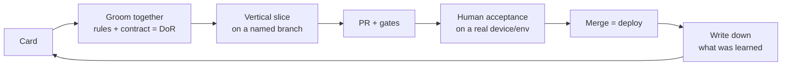

# 2. The loop

**Card.** One outcome, one card, numbered. A new problem found while working
on a closed card gets a new card; reusing an old number hides history.

**Groom together, just in time.** The human and the agent write the rules,
the errors and the contract *when the card is picked up* — not weeks ahead,
when half the answers are guesses. That is the Definition of Ready.

**Vertical slice.** The smallest change that goes all the way through: domain
rule → use case → API → client. One slice, one PR.

**Gates.** The PR is not ready until the build is green. The agent runs the
same `make check` CI runs, before claiming anything.

**Human acceptance.** Green CI proves the code does what the tests say. A
person using the feature proves it does what was meant. Both, in that order.

**Merge = deploy.** With GitOps, merging to `main` is the release. That is
why merge is a human decision.

**Write it down.** Anything the next session would otherwise rediscover —
a trap, a decision, a preference — goes into memory
([04-memory.md](04-memory.md)) before the session ends.
